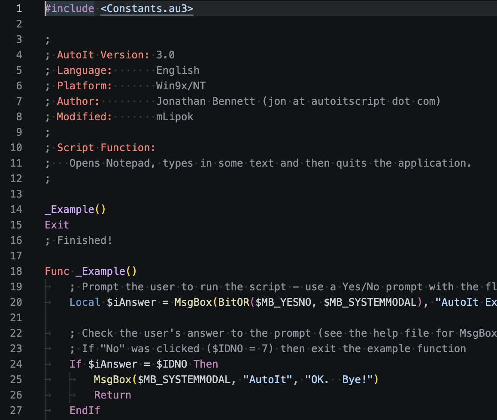
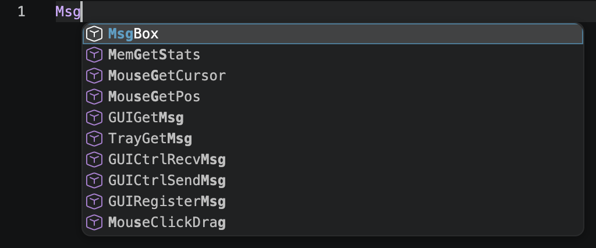
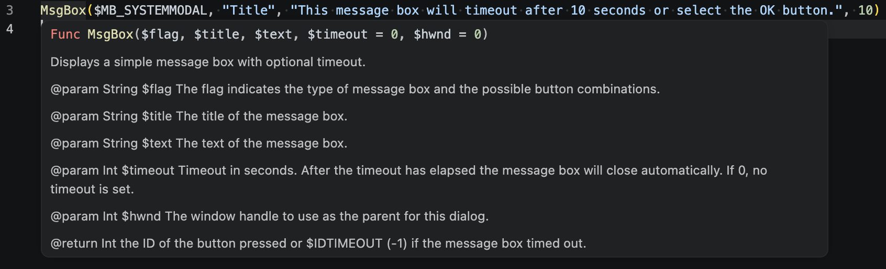
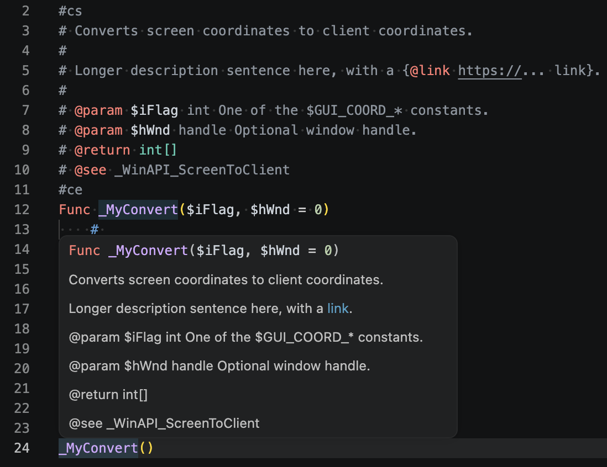

# AutoIt

Syntax highlighting for AutoIt3, with partial IntelliSense.

## Features

* AutoIt3 syntax highlighting, including DocBlock comments and legacy UDF documentation headers, plus code within `Execute` string literals
* AutoIt3 IntelliSense, resolving declarations across `#include` files, the AutoIt3 installation include directory and user defined library directories:
  * Completion suggestions for keywords, macros, built-in functions, variables, user defined functions, preprocessor directives and snippets
  * Optional completion suggestions for functions and global variables from all workspace files, even when not included. Accepting one inserts the required `#include` (see `autoit3.workspaceCompletions`)
  * Hover information with function/variable DocBlock and legacy UDF header support, scope information (local/global) and colored function signatures. DocBlocks use a phpDocumentor-style comment format with a summary, description and tags like `@param`, `@return`, `@see` and `@link`
  * Function signature help
  * Go to definition / peek, showing all matching declarations across scopes and included files (toggleable)
  * Find all references
  * Document highlight
  * Document symbols
* Diagnostics for syntax errors, unresolvable `#include` statements and syntax errors inside `Execute` string literals
* Document links for `#include` statements
* Snippets for UDF DocBlock comments, function declarations, loops and more
* Workspace indexing of AutoIt3 scripts on startup with progress indication, and file watching for created/changed/deleted files
* Runs in web (vscode.dev)

## Screenshots

### Syntax highlighting

### Completion suggestions

### Hover information

### DocBlock comment with rendered hover

## Extension Settings

This extension contributes the following settings:

* `autoit3.installDir`: The path to a AutoIt3 installation directory.
* `autoit3.userDefinedLibraries`: Array of directories that should be searched for files when IntelliSense is resolving `#include`'s in addition to the standard locations.
* `autoit3.version`: The target AutoIt3 version for the IntelliSense (currently only `3.3.14.5`).
* `autoit3.ignoreInternalInIncludes`: Will ignore variables and function declarations in includes, prefixed with `__`, indicating internal usage.
* `autoit3.showAllDeclarations`: When enabled, go to definition shows all matching declarations across scopes and included files. When disabled, only the closest matching declaration is shown.
* `autoit3.workspaceCompletions`: When enabled, completion suggestions include functions and global variables from all workspace files, even when not included. Suggestions are ranked after included and native suggestions, and only appear once text has been typed. Accepting such a suggestion inserts the required `#include` after the last top-level include statement.

## AutoIt2

Legacy AutoIt2 syntax highlighting for `.aut` files (targeting AutoIt v2.64), with its own file icon.
